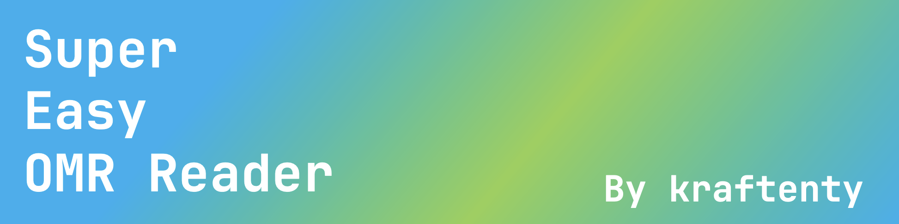

# Super-Easy OMR Reader
OpenCV-based real-time OMR card scoring program  
*OpenCV 기반의 실시간 OMR카드 채점 프로그램*

No more buying expensive OMR readers and cards. Super-Easy OMR Reader, as its name suggests, is very easy and convenient. Just get your computer and webcam ready!  
*이제 더 이상 비싼 OMR 리더기와 카드를 구매하지 마십시오. Super-Easy OMR Reader는 이름 그대로 매우 쉽고 편리합니다. 컴퓨터와 웹캠만 준비하십시오!*

---
## Contents
- [Overview](#overview)
- [Preparation](#preparation)
- [How To Use](#how-to-use)
- [License](#license)
---
## Overview
---
## Preparation
---
## How To Use
---
## License