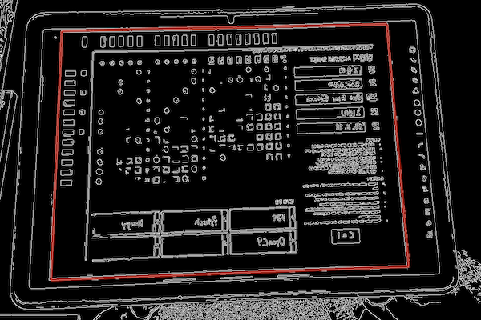
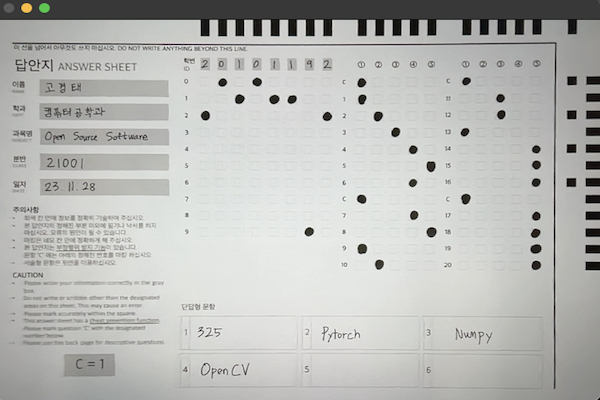

# Super-Easy OMR Reader
OpenCV-based real-time OMR card scoring program  
<small>*OpenCV 기반의 실시간 OMR카드 채점 프로그램*</small>

No more buying expensive OMR readers and cards. Super-Easy OMR Reader, as its name suggests, is very easy and convenient. Just get your computer and webcam ready!  
<small>*이제 더 이상 비싼 OMR 리더기와 카드를 구매하지 마십시오. Super-Easy OMR Reader는 이름 그대로 매우 쉽고 편리합니다. 컴퓨터와 웹캠만 준비하십시오!*</small>

---
## Contents
- [Preparation](#preparation)
- [How To Use](#how-to-use)
- [Detail](#detail)
- [License](#license)
---
## Preparation
- Things You Need
> Prepare a computer with Python installed and a webcam. A laptop with a built-in webcam would be better.  
> <small>*파이썬이 설치되어 있는 컴퓨터와 웹캠을 준비하십시오. 웹캠이 내장되어 있는 노트북이면 더 좋습니다.*</small>
- How To Run
> 1. Install the Python library listed in the `requirement.txt` file.  
> You can also install it all at once by running the command `$ pip install -r requirement.txt`.  
>  <small>*`requirement.txt` 파일에 적혀 있는 파이썬 라이브러리를 설치하십시오.*  
>  *`$ pip install -r requirement.txt` 명령어를 실행하여 한 번에 설치할 수도 있습니다.*</small>
>
> 2. Run `app.py` with `$ python3 app.py`.  
> *`$ python3 app.py` 로 `app.py` 를 실행하십시오.*
---
## How To Use
1. Prepare `SafeSheet™`
> 
> `SafeSheet™`, an answer sheet exclusively for Super-Easy OMR Reader, is prepared for you. Download the `safesheet.pdf` file. This special answer sheet includes anti-cheating features, so students will no longer be able to copy other students' answer sheet patterns.
> The `safesheet.pdf` file contains a total of 4 answer sheets, and each answer sheet has a different `SafeNum™` and `SafeCode™`.
> Please note that the special `Safe™` function unique to this program is introduced in [Detail](#detail).
>
> *Super-Easy OMR Reader 전용 답안지인 `SafeSheet™`이 당신을 위해 준비되어 있습니다. `safesheet.pdf` 파일을 다운로드 받으십시오. 이 특별한 답안지는 부정행위 방지 기능이 포함되어 있어서, 학생들이 다른 학생의 답안지 패턴을 그대로 베끼는 일은 이제 없을 겁니다.   
> `safesheet.pdf` 파일은 총 4개의 답안지를 포함하고 있고, 각 답안지는 `SafeNum™` 과 `SafeCode™` 가 모두 다릅니다.  
> 이 프로그램만의 특별한 `Safe™` 기능은 [Detail](#detail) 에 소개되어 있으니 참고하세요.*

2. Take the test
> 
> When creating test questions, you can create up to 20 multiple-choice questions in total. You can also create questions so that you can choose multiple answers per question.
> Print out four different `SafeSheets™` to be distributed equally and randomly to students.
> Before the test begins, distribute the printed `SafeSheets™` to students randomly. It is also a good strategy to have students receive a different `SafeSheet™` from the row next to them.
>
> *시험 문제를 만들 때 객관식 문제는 총 `20문제` 까지 만들 수 있습니다. 또한 한 문제에 여러 개의 답을 고르도록 문제를 만들 수 있습니다.  
> 서로 다른 4개의 `SafeSheet™` 이 학생들에게 무작위로 균등하게 분배될 수 있도록 인쇄하십시오.  
> 시험 시작 전, 인쇄한 `SafeSheet™` 들을 학생들에게 무작위로 나눠주십시오. 학생들이 옆 줄과 다른 `SafeSheet™` 를 받도록 하는 것 또한 좋은 전략입니다.*

3. Input your answer
> Enter the correct answer for your test in the `answer.json` file as shown below. You can enter up to 20 times in total.
> *`answer.json` 파일에 당신의 시험의 정답을 아래와 같이 입력하십시오. 총 20번까지 입력 가능합니다.*
> ```javascript
> {
>    "1" : {
>        "answer" : 3,
>        "points" : 5
>    },
>    "2" : {
>        "answer" : [1, 4],
>        "points" : 4
>    },
>    "3" : {
>        "answer" : 5,
>        "points" : 8
>    },
> }
> 
> // The answer to question 1 is 3, and the score is 5 points.
> // The answer to question 2 is 1 and 4, and the score is 5 points.
> // The answer to question 3 is 5, and the score is 8.
> // ...
> // 1번 문제의 답은 3번, 배점은 5점
> // 2번 문제의 답은 1번과 4번, 배점은 5점
> // 3번 문제의 답은 5번, 배점은 8점
> // ...
> ```

4. Scan the SafeSheet
> 
> * Run this program and hold the `SafeSheet™` close to the `Live WebCam Scanner` screen so that the border is clearly visible.
> * If recognition is successful, the recognized test sheet screen appears on the `Detected Sheet` screen on the right. Additionally, information about `Student ID`, `SafeCode`, `Is SafeCode Valid`, `OX`, and `Point` recognized in the test paper is displayed.
> * Super-Easy OMR Reader is very accurate, but grading results may vary due to student marking mistakes. Therefore, we recommend that you review the `Detected Sheet` screen.
> * Once the review is complete, click the `Save` button or `Space Bar` to save. Results are automatically saved as a txt file.
> * Repeat until all students’ `SafeSheet™` has been saved.
>
> * _본 프로그램을 실행하고, `Live WebCam Scanner` 화면에 `SafeSheet™` 를 테두리가 명확히 나오도록 가까이 가져다 대십시오._  
> * _인식이 성공하면, 오른쪽의 `Detected Sheet` 화면에 인식된 시험지 화면이 나옵니다. 또한 시험지에서 인식한 `Student ID`, `SafeCode`, `Is SafeCode Valid`, `OX`, `Point` 정보가 나옵니다._ 
> * _Super-Easy OMR Reader는 매우 정확합니다만, 학생의 마킹 실수로 채점 결과가 달라질 수 있습니다. 따라서 `Detected Sheet` 화면을 한 번 검토해 보시는 것을 추천드립니다._  
> * _검토가 완료되었으면 `Save` 버튼이나 `Space Bar` 를 눌러 저장합니다. 결과는 txt 파일로 자동 저장됩니다._
> * _모든 학생의 `SafeSheet™` 를 저장할 때까지 반복하시면 됩니다._

5. Check the saved file
>   
> A txt file containing students' `Student ID`, `Answer`, and `Total Point` is automatically created. Please use these results to calculate your grades!  
> *학생들의 `Student ID`, `Answer`, `Total Point` 가 포함된 txt 파일이 자동으로 생성됩니다. 이 결과를 가지고 성적 산출에 활용하시길 바랍니다!*

---
## Detail
- How `Safe™` works
> 
> The existing answer sheet had a problem in that the answer pattern could be copied from the side. Therefore, in important tests such as the CSAT, the test papers and answer sheets were divided into odd and even numbers. However, this method had the disadvantage of having to create both test papers and answer sheets separately, and in small-scale tests, this method could be a significant burden. Therefore, after careful consideration, we invented a way to effectively prevent cheating while making only the answer sheet different, and that is `Safe™`.
>
> *기존의 답안지는 답의 패턴을 옆에서 그대로 베낄 수 있는 문제점이 있었습니다. 때문에 수능 등의 중요한 시험에서는 홀수형/짝수형으로 시험지와 답안지를 나눠 시험을 쳤습니다. 하지만 이 방법은 시험지와 답안지를 모두 따로 만들어야 한다는 단점이 존재했고, 작은 규모의 시험에서는 이러한 방식이 상당한 부담으로 다가올 수 있습니다. 따라서 답안지만 다르게 만들면서도 효과적으로 부정행위를 방지할 수 있는 방안을 고심 끝에 발명했고, 그것이 바로 `Safe™` 입니다.*  
>
> `Safe™` is built into the answer sheet, `SafeSheet™`, and this program.
> The `Safe™` function consists of `SafeNum™` and `SafeCode™`.
>
> *`Safe™` 는 답안지인 `SafeSheet™` 와 본 프로그램에 내장되어 있습니다.  
> `Safe™` 기능은 `SafeNum™` 과 `SafeCode™` 로 구성됩니다.*  
>
> `SafeNum™`: This is a function that inserts `C` in the middle of the answer marking sequence, allowing you to write the answer back when the person next to you copies it. A total of 4 `C`s are inserted, and the index at which `C` is inserted is one of 0, 4, 7, and 11. This is determined by the pre-printed mark on the far right of the `SafeSheet™`. The program will then scan the printed marks and grade them, skipping the 'C' index when grading.
>
> *`SafeNum™` : 답을 마킹하는 순서 중간중간에 `C` 를 넣어서, 옆 사람이 그대로 베꼈을 때 답을 밀려 쓰도록 하는 기능입니다. `C` 는 총 4개 삽입되며, `C` 가 삽입되는 인덱스는 0, 4, 7, 11 중에 하나입니다. 이는 `SafeSheet™` 의 맨 오른쪽에 있는 미리 인쇄된 마크에 의해 결정됩니다. 그러면 프로그램이 인쇄된 마크를 스캔하여 채점 시 `C` 인덱스를 건너뛰고 채점하게 됩니다.*
>
> `SafeCode™`: Even if there is a `SafeNum™` function, the probability of cheating success increases if all students promise in advance to mark the `C` index with a specific number. Therefore, we introduced `SafeCode™`, a function that pre-assigns a number to be marked in the `C` index for each test paper and marks it with that number. If the student marks a different number for the `C` index, `Is Safecode Valid = False` will be displayed during grading.
>
> *`SafeCode™` : `SafeNum™` 기능이 있다 하더라도, 학생들 전체가 사전에 `C` 인덱스를 특정 번호로 마킹하자고 약속하면 컨닝 성공 확률이 올라가게 됩니다. 따라서 `C` 인덱스에 마킹할 번호를 시험지마다 미리 정해주고 그 번호로 마킹하게 하는 기능인 `SafeCode™` 를 도입했습니다. 만약 학생이 `C` 인덱스에 다른 번호를 마킹했다면, 채점 시에 `Is Safecode Valid = False` 라고 표시됩니다.*  

- How is `SafeSheet™` scanned
> The `scan_image` function in `scanner.py` is responsible for image scanning.  
> *`scanner.py`의 `scan_image` 함수가 이미지 스캔을 담당합니다.*
> 1. Continuously retrieve frames captured from the webcam every 200ms.  
> *웹캠에서 200ms 주기로 캡쳐한 프레임을 계속해서 가져옵니다.*
> 
> 2. If a square larger than 1/1.125 times the screen area is detected in the frame, the original image is saved.  
> *프레임에서 화면 면적의 1/1.125배 이상의 사각형이 검출되면 원본 이미지를 저장합니다.*
> 
> 3. Crop the image along a square, remove the border, and remove perspective through perspective conversion to make it easier to use.  
> *사각형을 따라 이미지를 자르고 테두리를 제거한 후 원근 변환을 통해 원근감을 없애서 활용하기 좋게 만듭니다.*
>   

- How is `SafeSheet™` detected
> The `getDetectedValues` function in `detector.py` is responsible for detecting markings in the scanned image.  
> *`detector.py`의 `getDetectedValues` 함수가 스캔된 이미지에서의 마킹 검출을 담당합니다.*
> 1. Binarize the image to facilitate point detection in the image.  
> *이미지에서의 점 검출을 용이하게 하기 위해 이미지를 이진화합니다.*
> 
> 2. Obtain Guide Points by scanning the area within 15px from the top and 15px from the right, and save the coordinates of the area where the x-coordinate of the top Guide Point and the y-coordinate of the right Guide Point overlap in the list.  
> *위에서 15px 이내와 오른쪽에서 15px 이내에 있는 영역을 스캔해서 Guide Points를 구하고, 상단 Guide Point의 x좌표와 우측 Guide Point의 y좌표가 겹치는 부분의 좌표를 리스트에 저장합니다.*
> 
> 3. It circulates through the list where coordinates are stored, distinguishes between marked and unmarked parts, and finally detects the marking.  
> *좌표가 저장된 리스트를 순환하며 마킹된 부분과 안된 부분을 구별하여 최종적으로 마킹을 검출합니다.*
> 


---
## References
- ChatGPT 4.0
- Github Copilot
---
## License
- MIT License
- Made by Ko Kyeong Tae (`kraftenty`)
- If you have questions, feel free to email `kraftenty@gmail.com`.